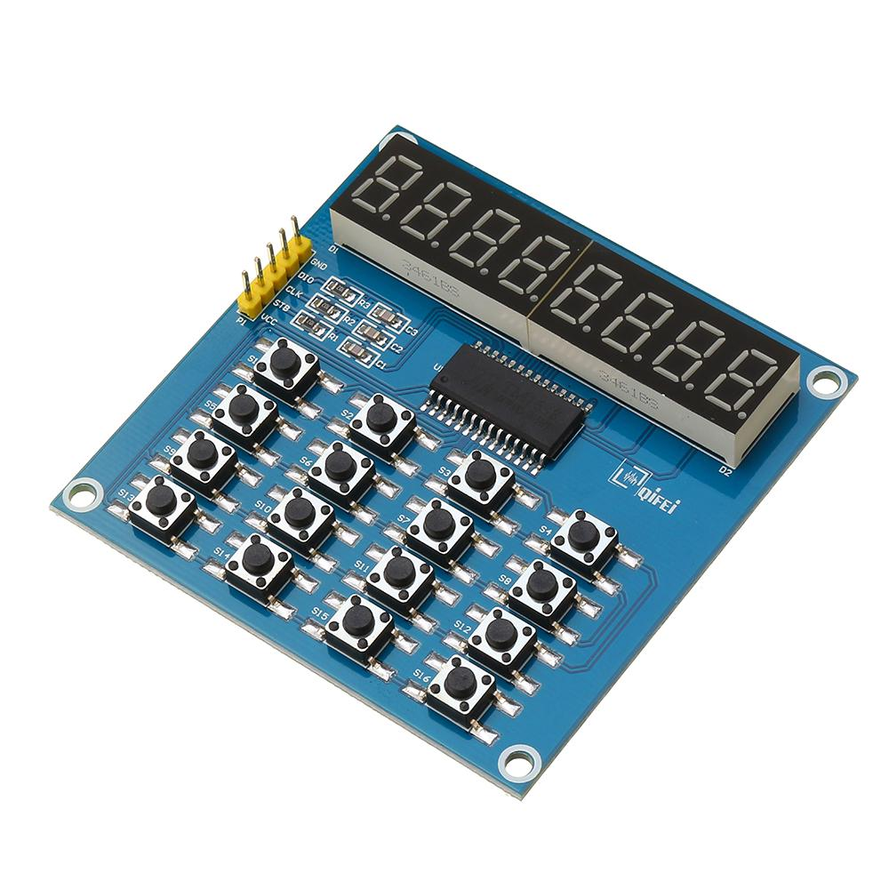

# MicroPython QYF-TM1638 Driver

A MicroPython library for QYF-TM1638 modules with 8x 7-segment decimal LED modules and keyscan.



## Examples

Copy the file to your device, using [ampy](https://github.com/adafruit/ampy), [rshell](https://github.com/dhylands/rshell), [webrepl](http://micropython.org/webrepl/) or compiling and deploying. eg.

```bash
$ ampy put tm1638.py
```

**Basic usage**

```python
# TinyPICO / ESP32
import tm1638
from machine import Pin
tm = tm1638.TM1638(stb=Pin(5), clk=Pin(18), dio=Pin(23))

# PI PICO / RP2040
import tm1638
from machine import Pin
tm = tm1638.TM1638(stb=Pin(13), clk=Pin(14), dio=Pin(15))

# STM32F407VET6
import tm1638
from machine import Pin
tm = tm1638.TM1638(stb=Pin('B4'), clk=Pin('B5'), dio=Pin('B6'))


# segments
tm.show('cool')
tm.show('abcdefgh')

# dim segments
tm.brightness(0)

# all segments off
tm.clear()

# get which buttons are pressed on QYF-TM1638 module
tm.keys()

```

For more detailed examples, see [examples](/examples).


# Methods

Power up, power down or check status.
```
power(val=None)
```

Get or set brightness.
```
brightness(val=None)
```

Write zeros to each address.
```
clear()
```

Write to all 16 addresses from a given position.
Order is left to right, 1st segment, 1st LED, 2nd segment, 2nd LED etc.
```
write(data, pos=0)
```


Set one or more segments at a relative position.
Only writes to the segment positions (every 2nd starting from 0).
```
segments(segments, pos=0)
```

Return a 16-bit value representing which keys are pressed. LSB is SW1.
```
keys()
```


Displays as much of a string as will fit.
```
show(string, pos=0)
```


## Parts

* [WeMos D1 Mini](https://www.aliexpress.com/store/product/D1-mini-Mini-NodeMcu-4M-bytes-Lua-WIFI-Internet-of-Things-development-board-based-ESP8266/1331105_32529101036.html) $6.36 AUD
* [LED&KEY TM1638 Module](https://www.aliexpress.com/item/TM1638-Module-Key-Display-For-AVR-Arduino-New-8-Bit-Digital-LED-Tube-8-Bit-TM1638/32805933184.html) $2.30 AUD
* [Female-Female Dupont wires](https://www.aliexpress.com/item/10pcs-10cm-2-54mm-1p-1p-Pin-Male-to-Male-Color-Breadboard-Cable-Jump-Wire-Jumper/32636873838.html) $0.62 AUD

## Connections

WeMos D1 Mini | LED&KEY TM1638 Module
------------- | -----------------
3V3 (or 5V)   | VCC
G             | GND
D7 (GPIO13)   | STB
D5 (GPIO14)   | CLK
D6 (GPIO12)   | DIO

STM32F407VET6 | LED&KEY TM1638 Module
------------- | -----------------
3V3           | VCC
G             | GND
B4            | STB
B5            | CLK
B6            | DIO

## Links

* [WeMos D1 Mini](https://wiki.wemos.cc/products:d1:d1_mini)
* [micropython.org](http://micropython.org)
* [TM1638 datasheet](http://titanmec.com/index.php/en/project/download/id/303.html)
* [Titan Micro TM1638 product page](http://titanmec.com/index.php/en/project/view/id/303.html)
* [Adafruit Ampy](https://learn.adafruit.com/micropython-basics-load-files-and-run-code/install-ampy)

## License

Licensed under the [MIT License](http://opensource.org/licenses/MIT).
